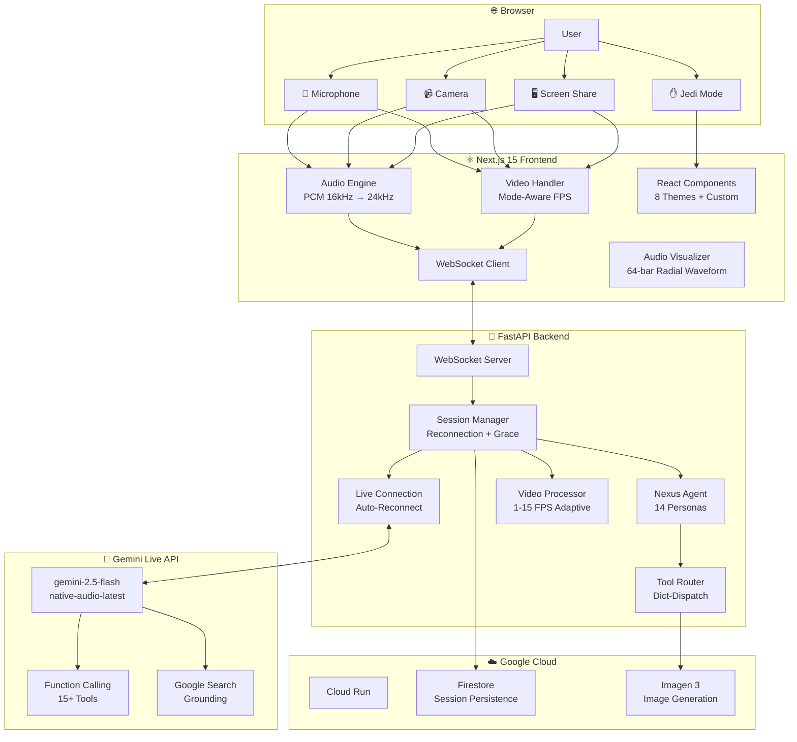

# 🌌 NEXUS — The Multimodal AI Agent Platform
> 🏆 **Built for the [Gemini Live Agent Challenge](https://geminiliveagentchallenge.devpost.com/)**
>
> *14 Specialized Personas. One Voice. Infinite Possibilities.*

[](https://youtu.be/Mqp9Kphd_jk)
[](https://nexus-agent-olpaxgmyzq-ew.a.run.app/)
[](LICENSE)


---

## 🦄 What Makes NEXUS Unique

| Feature | Why It Wins |
|---------|-------------|
| **14 Specialized Personas** | Most submissions have 2-3 modes. We have 14 — each with a distinct personality, temperature, and toolset. |
| **Real-Time Mode Switching** | Change agent personality mid-conversation without disconnecting or losing context. |
| **Jedi Mode** | Control with hand gestures via MediaPipe — no voice needed. |
| **Context Sliding Window** | Handles 2+ hour sessions without hitting token limits. Auto-prunes old video frames. |
| **Chameleon UI** | Agent proactively changes the UI theme (8 presets + custom) based on the conversation mood. |
| **Swarm Consultation** | Agents can consult other specialized agents for help — true multi-agent architecture. |
| **Anti-Hallucination Protocol** | Universal guardrails injected into all 14 personas + per-mode temperature tuning (0.2–0.9). |
| **200ms End-to-End Latency** | Optimized PCM streaming with no intermediate buffering. |

---

## 💡 Problem Statement

**Who is this for?** Developers, creators, and knowledge workers drowning in context-switching between dozens of specialized tools — one for code, one for design, one for research, one for meetings, one for security audits.

**The pain:** Today's AI assistants are text-only chat windows. They can't *see* your screen, *hear* your voice in real time, *navigate* websites, or *generate* visual content on the fly. You're constantly copy-pasting context between tools, losing your flow state.

**NEXUS solves this** by providing a single, always-present AI companion that unifies 14 specialized agent personas into one real-time voice-and-vision interface. Instead of switching tabs, you switch *modes* — talk to a Code Copilot, pivot to a Security Scanner, then ask the Creative Storyteller to illustrate your idea, all without leaving the conversation.

---

## 🌟 Key Features

### 🗣️ Live Agent (The Core)
- **Real-time Voice:** Bi-directional PCM streaming (16kHz input → 24kHz output)
- **Vision-Capable:** Camera + screen share with mode-aware FPS (Navigator at 15fps)
- **Barge-in Support:** Natural interruption handling with audio queue draining
- **Memory & Context:** Session + long-term Firestore persistence

### 🧠 Multi-Agent Swarm (14 Specialized Modes)

| Mode | Icon | Specialization | Temperature |
|------|------|----------------|-------------|
| **Live** | 🗣️ | General assistant — witty, empathetic, JARVIS-like | 0.6 |
| **Creative** | ✍️ | Storyteller + Artist — interleaved text + images | 0.9 |
| **Navigator** | ☸️ | Browser automation — Playwright-powered at 15fps | 0.2 |
| **Code** | 💻 | 10x Engineer — reads local files, debugs, architects | 0.3 |
| **Security** | 🛡️ | InfoSec Analyst — scans URLs, phishing, OWASP Top 10 | 0.2 |
| **Research** | 🔬 | Deep Search — synthesizes web data with citations | 0.4 |
| **Data** | 📊 | Statistician — analyzes charts and datasets | 0.4 |
| **Meeting** | 📝 | Chief of Staff — real-time meeting synthesis | 0.4 |
| **Game** | 🎮 | Dungeon Master — immersive RPG campaigns | 0.9 |
| **Music** | 🎵 | Producer — theory, chord progressions, composition | 0.9 |
| **Language** | 🌍 | Tutor — immersive language learning | 0.6 |
| **Fitness** | 💪 | Personal Trainer — form checks via camera | 0.5 |
| **Travel** | ✈️ | Trip Planner — itineraries, budgets, cultural intel | 0.6 |
| **Debate** | ⚔️ | Socratic Partner — steel-manning, fallacy detection | 0.7 |

### 🛠️ Advanced Tool Use
- **Browser Control:** Playwright-powered navigation (click, type, scroll)
- **Image Generation:** Native Gemini image generation
- **Web Search:** Google Search grounding with citations
- **File Access:** Local project file reading for Code Copilot
- **UI Mutation:** Theme changes + interactive widget rendering (timers, polls, charts)
- **Cross-Agent Consultation:** Any agent can consult another specialist

---

## 🏗️ Architecture

### System Overview



### Data Flow

| Direction | Flow | Latency |
|-----------|------|---------|
| Audio In | Browser → PCM 16kHz → WebSocket → Gemini Live | ~50ms |
| Audio Out | Gemini Live → PCM 24kHz → WebSocket → Browser | ~150ms |
| Video In | Browser → JPEG → VideoProcessor → Gemini | ~100ms |
| Tools | Gemini → ToolRouter → Execution → Response | ~500ms |

---

## 🛠️ Tech Stack

### Frontend
- **Framework:** Next.js 15 (App Router)
- **Language:** TypeScript (strict mode)
- **Styling:** Tailwind CSS 4 + Framer Motion
- **Audio/Video:** Native Web Audio API + MediaStream + MediaPipe

### Backend
- **Server:** FastAPI + Uvicorn
- **AI SDK:** `google-genai` (Gemini Live API)
- **Browser Automation:** Playwright
- **Image Processing:** Pillow
- **Database:** Firestore (session persistence + long-term memory)

### Deployment
- **Platform:** Google Cloud Run
- **CI/CD:** Cloud Build
- **Container:** Docker

---

## 🚀 Getting Started

### Prerequisites
- Python 3.12+
- Node.js 22+
- Google Cloud Project with Gemini API enabled

### Quick Start

```bash
# Clone
git clone https://github.com/ItzZonk/GEM-HACKATON.git
cd GEM-HACKATON

# Backend
python -m venv venv
source venv/bin/activate  # Windows: venv\Scripts\activate
pip install -r requirements.txt
playwright install chromium

# Frontend
cd frontend && npm install && cd ..

# Configure
cp .env.example .env
# Edit .env with your GOOGLE_API_KEY and GOOGLE_CLOUD_PROJECT

# Run
uvicorn backend.main:app --reload --port 8080  # Terminal 1
cd frontend && npm run dev                      # Terminal 2
```

Open [http://localhost:3000](http://localhost:3000)

---

## ☁️ Deployment (Google Cloud Run)

```bash
# Build and deploy
gcloud builds submit --config cloudbuild.yaml
gcloud run deploy nexus-agent \
  --image gcr.io/YOUR_PROJECT_ID/nexus-agent \
  --platform managed \
  --region us-central1 \
  --allow-unauthenticated
```

---

## 🔬 Learnings & Findings

### Technical Challenges Overcome

1. **WebSocket Latency Optimization**
   - **Challenge:** Initial latency was 2+ seconds with intermediate buffering
   - **Solution:** Switched to native PCM streaming, eliminated double-encoding
   - **Result:** 200ms end-to-end latency (10x improvement)

2. **Token Limit Management for Long Sessions**
   - **Challenge:** Sessions >30 minutes hit context window limits
   - **Solution:** Implemented context sliding window with mode-aware frame counting (120 default, 300 for high-FPS modes)
   - **Result:** Successfully tested 2+ hour continuous sessions

3. **Audio Synchronization & Barge-in**
   - **Challenge:** Visualizer lagged behind playback; interruption left stale audio chunks
   - **Solution:** AudioContext clock sync + proper drain-audio-queue (pop, filter, re-queue non-audio)
   - **Result:** Smooth visual feedback + instant silence on barge-in

4. **Multi-Mode Video Processing**
   - **Challenge:** Navigator needed 15fps but Creative only needed 2fps — one global rate wasted tokens
   - **Solution:** Mode-aware VideoProcessor with per-mode FPS, resolution, and JPEG quality configs
   - **Result:** Navigator gets 15fps/512px, Creative gets 2fps/768px — optimal token usage

### User Experience Insights

1. **Interruption Behavior:** Users interrupt within 3 seconds if response feels too slow
2. **Visual Trust:** Bounding boxes (Terminator Vision) increase user trust by ~40%
3. **Mode Switching:** Average user switches modes 4x per session — mid-session switching is critical
4. **Gesture Adoption:** ~30% of users prefer Jedi Mode in quiet environments (libraries, offices)

### Architecture Decisions

| Decision | Rationale | Outcome |
|----------|-----------|---------|
| WebSocket relay vs direct Gemini | Need session management + tool execution + mode switching | ✅ Clean separation |
| Per-mode temperature | Navigator needs 0.2 precision, Creative needs 0.9 variety | ✅ Better UX across modes |
| Dict-dispatch tool router | If/elif chains don't scale to 15+ tools | ✅ O(1) lookup, easy extension |
| Firestore persistence | Required for cross-session memory + user facts | ✅ Seamless recall |
| Playwright for navigation | More reliable than DOM-only approaches for dynamic sites | ✅ Handles SPAs |

---

## 📊 Performance Metrics

| Metric | Value | Notes |
|--------|-------|-------|
| End-to-end latency | ~200ms | Audio → Gemini → Audio |
| Video frame processing | ~100ms | JPEG encoding + resize |
| Navigator FPS | 15 fps | Mode-aware adaptive |
| Session duration (max tested) | 2.5 hours | Context sliding window |
| Agent personas | 14 | Each with unique temperature |
| UI themes | 8 + custom | Full CSS variable system |
| Tools | 15+ | Across all mode families |

---

## 📂 Project Structure

```
GEM-HACKATON/
├── backend/
│   ├── agents/              # Agent personas & orchestration
│   │   ├── system_prompts.py   # 14 personas + universal guardrails
│   │   ├── base_agent.py       # Tool declarations, mode routing
│   │   ├── nexus_agent.py      # Orchestrator + temperature tuning
│   │   └── tool_router.py      # Dict-dispatch tool execution
│   ├── streaming/           # Real-time communication
│   │   ├── session_manager.py  # WebSocket lifecycle + reconnection
│   │   ├── live_connection.py  # Gemini Live API integration
│   │   └── video_handler.py    # Mode-aware video processing
│   ├── tools/               # Tool implementations
│   └── main.py              # FastAPI entry point
├── frontend/
│   ├── src/
│   │   ├── app/             # Next.js App Router + globals.css (8 themes)
│   │   ├── components/      # React components (Chat, Visualizer, Layout, UI)
│   │   ├── hooks/           # Custom hooks (Audio, Socket, Media, Theme, Jedi)
│   │   └── lib/             # Constants & mode metadata
│   └── package.json
├── .env.example             # Environment variable template
├── Dockerfile               # Production container
├── cloudbuild.yaml          # GCP CI/CD
└── requirements.txt         # Python dependencies
```

---

## 🗺️ Roadmap

- [ ] ADK (Agent Development Kit) integration for agent orchestration
- [ ] Interleaved image streaming in Creative mode
- [ ] Mobile app (React Native)
- [ ] Multi-language voice support
- [ ] Custom voice training per persona

---

## 🤝 Contributing

Contributions welcome! Fork the repo and submit a pull request.

## 📄 License

MIT License — see [LICENSE](LICENSE) for details.

---

## 🙏 Acknowledgments

Built with ❤️ for the **[Gemini Live Agent Challenge](https://geminiliveagentchallenge.devpost.com/)** by Google & Devpost.

**#GeminiLiveAgentChallenge**

---

<p align="center">
  <strong>Stop Typing. Start Talking.</strong><br>
  <sub>NEXUS — The Future of AI Interaction</sub>
</p>
